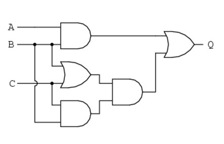
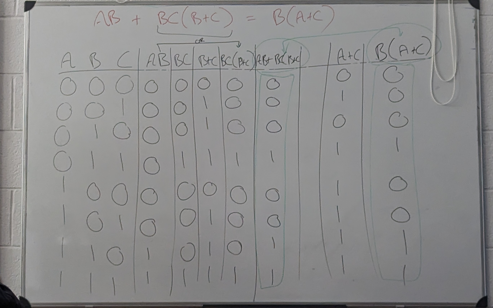

# Circuit simplificationExample

## Step1:Write a Boolean expression for the circuit



The circuit is shown below.

= AB + BC (B + C)

## Step2:Use Boolean simplification to reduce this expression

= AB + BC (B + C)

= AB + BBC + BCC

= AB + BC + BC

= AB + BC

= BC(A + C)


```