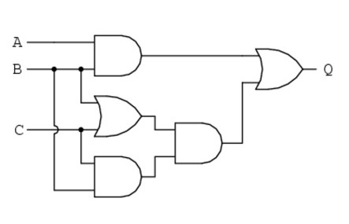

# Circuit Simplification Example

## Step1: Write a Boolean expression for the circuit

The circuit is shown below.

We have three inputs A, B, and C. Name each gate from top-left to bottom-right as M, N, O, P, and Q (Already specified in the diagram).

We will deal with the diagram in 3 steps.  Step 1, the first 3 gates taking inputs from A, B, C
The result of the first 3 gates are

- M = AB
- N = B+C
- O = BC

Step 2, calculate the next gate P, which takes inputs from N and O.

P = N \* O
$P = (B+C) \cdot BC$

Step 3, calculate the final gate `Q`, which takes inputs from `M` and `P`.

`Q` = `M` + `P`
`Q` = AB + (B+C) * BC

The final expression is AB + (B+C) * BC

| A | B | C | M=(AB) | O=(BC) | N=(B+C) | P= (NO) | Q=(M+P) |
| - | - | - | :----: | :----: | :-----: | :-----: | :-----: |
| 0 | 0 | 0 |   0   |   0   |    0    |    0    |    0    |
| 0 | 0 | 1 |   0   |   0   |    1    |    0    |    0    |
| 0 | 1 | 0 |   0   |   0   |    1    |    0    |    0    |
| 0 | 1 | 1 |   0   |   1   |    1    |    1    |    1    |
| 1 | 0 | 0 |   0   |   0   |    0    |    0    |    0    |
| 1 | 0 | 1 |   0   |   0   |    1    |    0    |    0    |
| 1 | 1 | 0 |   1   |   0   |    1    |    0    |    1    |
| 1 | 1 | 1 |   1   |   1   |    1    |    1    |    1    |

## Step2: Use Boolean simplification to reduce this expression

$Q = AB + (B+C) \cdot BC$

= AB + BC (B + C)

= AB + BBC + BCC // Using Rule AA =A

= AB + BC + BC // Using Rule A+A = A

= AB + BC

= B(A + C)

Draw circuits using:
[https://digitaljs.tilk.eu/](https://digitaljs.tilk.eu/)
